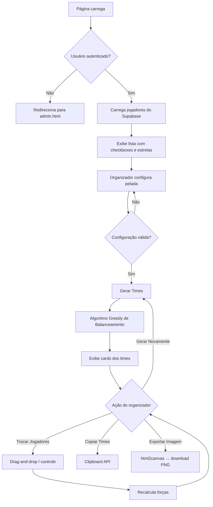

# Design Técnico: Gerador de Times da Pelada

## Visão Geral

A feature adiciona a página `gerador-times.html` ao projeto Sapos League. O objetivo é permitir que o organizador selecione os jogadores presentes, configure o formato da pelada e gere times balanceados com base no nível (1–5 estrelas) de cada jogador, armazenado no Supabase.

A página segue o mesmo padrão visual e técnico de `gerador-rodadas.html`: HTML/CSS/JS vanilla, autenticação via Firebase Auth (padrão do projeto), dados de jogadores via Supabase, dark mode via CSS custom properties.

**Decisão de autenticação:** O projeto usa Firebase Auth para autenticação (conforme `auth-manager.js` e `gerador-rodadas.js`). O Supabase é usado apenas para dados (tabela `jogadores`). A nova página seguirá o mesmo padrão: Firebase Auth para login/logout, Supabase para leitura/escrita de dados.

---

## Arquitetura

```
gerador-times.html
├── css/dark-mode-colors.css   (variáveis de tema, já existente)
├── css/components.css         (componentes base, já existente)
├── css/gerador-times.css      (estilos específicos da página, novo)
└── js/gerador-times.js        (lógica principal, novo, ES module)
    ├── Firebase Auth           (autenticação, padrão do projeto)
    ├── Supabase JS (CDN)       (leitura/escrita de jogadores e peladas)
    └── html2canvas (CDN)       (exportação de imagem, carregado sob demanda)
```

### Fluxo principal



---

## Componentes e Interfaces

### gerador-times.html

Estrutura de seções:

1. **Header** — botão "← Voltar ao Painel", título "⚽ Gerador de Times", botão "Sair" (logout)
2. **Seção: Lista de Jogadores** — lista com checkboxes, estrelas, botões "Selecionar Todos" / "Limpar Seleção", contador de selecionados, botão de edição de nível inline
3. **Seção: Configuração da Pelada** — seletor de número de times (2–6), seletor de jogadores por time (2–15), total calculado, alerta de diferença, toggle "Separar Goleiros", marcação de goleiros por sessão
4. **Seção: Times Gerados** (oculta até gerar) — cards dos times com drag-and-drop, resumo de forças, botões "Gerar Novamente" / "Copiar Times" / "Exportar Imagem" / "Salvar Times"
5. **Modais** — confirmação, mensagem, edição de nível

### js/gerador-times.js

Módulos internos (funções agrupadas por responsabilidade):

```
Auth
  inicializarAuth()          — Firebase onAuthStateChanged, redirect se não autenticado

Supabase
  carregarJogadores()        — SELECT id, nome, nivel FROM jogadores ORDER BY nome
  atualizarNivelJogador(id, nivel) — UPDATE jogadores SET nivel = ? WHERE id = ?
  // salvarPelada removido — histórico não é necessário

UI - Lista
  renderizarLista(jogadores)
  renderizarEstrelas(nivel)  — retorna string "★★★☆☆"
  toggleSelecao(id)
  atualizarContador()
  selecionarTodos()
  limparSelecao()
  abrirEdicaoNivel(id)
  salvarEdicaoNivel(id, novoNivel)

UI - Configuração
  atualizarTotalNecessario()
  validarConfiguracao()      — retorna { valida, mensagem }
  toggleSepararGoleiros()
  renderizarSeletorGoleiros()

Balanceamento
  gerarTimes(jogadores, config) — algoritmo greedy (ver abaixo)
  calcularForca(time)
  calcularDiferenca(times)
  criarJogadorGenerico(nivel, index)

UI - Resultado
  renderizarTimes(times)
  renderizarCard(time)
  atualizarResumo(times)
  inicializarDragAndDrop()
  trocarJogadores(jogadorId, timeOrigemId, timeDestinoId)
  desfazerTroca()

Exportação
  copiarTimes(times)         — Clipboard API
  exportarImagem(times)      — html2canvas → download
  formatarTextoTimes(times)  — retorna string formatada para WhatsApp
```

---

## Modelos de Dados

### Supabase — tabela `jogadores` (existente, com adição de coluna)

```sql
-- Coluna a adicionar se não existir:
ALTER TABLE jogadores ADD COLUMN IF NOT EXISTS nivel INTEGER DEFAULT 1 CHECK (nivel >= 1 AND nivel <= 5);
```

| Coluna | Tipo | Descrição |
|--------|------|-----------|
| id | uuid / serial | PK |
| nome | text | Nome do jogador |
| nivel | integer (1–5) | Habilidade; default 1 se null |

*(Tabela `peladas` removida — histórico não é necessário para esta feature.)*

### Estado interno (JS — objeto em memória)

```js
const state = {
  jogadores: [],          // [{ id, nome, nivel, selecionado, goleiro }]
  config: {
    numTimes: 2,
    jogadoresPorTime: 5,
    separarGoleiros: false,
  },
  times: [],              // [{ id, nome, jogadores[], forca }]
  historicoDeTrocas: [],  // [{ timeOrigemId, timeDestinoId, jogadorId, snapshot }]
};
```

---

## Algoritmo de Balanceamento (Greedy)

```
função gerarTimes(jogadores, config):
  1. SE config.separarGoleiros:
       goleiros = jogadores filtrados como goleiro_da_sessão
       embaralhar(goleiros)
       distribuir um goleiro por time (round-robin aleatório)
       restantes = jogadores sem goleiros
     SENÃO:
       restantes = todos os jogadores

  2. Ordenar restantes por nivel DESC
     Para jogadores com mesmo nivel: embaralhar entre si

  3. Para cada jogador em restantes:
       time_alvo = time com menor forca_acumulada
       Em empate de força: time com menor número de jogadores
       Em empate de força e quantidade: escolha aleatória
       Adicionar jogador ao time_alvo

  4. vagas = (config.numTimes × config.jogadoresPorTime) - len(jogadores_reais)
     Para cada vaga:
       time_mais_fraco = time com menor forca_acumulada
       nivel_ideal = arredondar(media_geral) clampado em [1,5]
       generico = { nome: "Jogador {nivel_ideal}⭐", nivel: nivel_ideal, generico: true }
       Adicionar generico ao time_mais_fraco

  5. Para cada time: embaralhar ordem interna dos jogadores

  retornar times
```

**Complexidade:** O(n log n) para ordenação + O(n × T) para distribuição greedy, onde T é o número de times. Para os tamanhos esperados (≤ 90 jogadores, ≤ 6 times) é instantâneo.

---

## Drag-and-Drop de Jogadores

Implementado com a API nativa HTML5 Drag and Drop:

- Cada `<li>` de jogador recebe `draggable="true"` e listeners `dragstart` / `dragend`
- Cada card de time recebe listeners `dragover` / `drop`
- Durante o drag, os cards de destino recebem classe CSS `.drop-target` para highlight visual
- Ao soltar: `trocarJogadores(jogadorId, timeOrigemId, timeDestinoId)` é chamado
- O snapshot do estado anterior é empilhado em `state.historicoDeTrocas` antes de cada troca
- "Desfazer Troca" faz pop do histórico e restaura o snapshot

---

## Exportação de Imagem

Usa `html2canvas` carregado via CDN apenas quando o botão é acionado (lazy load):

```js
async function exportarImagem(times) {
  if (!window.html2canvas) {
    await carregarScript('https://cdnjs.cloudflare.com/ajax/libs/html2canvas/1.4.1/html2canvas.min.js');
  }
  const el = document.getElementById('times-resultado');
  const canvas = await html2canvas(el, { backgroundColor: null, scale: 2 });
  const link = document.createElement('a');
  link.download = 'times-pelada.png';
  link.href = canvas.toDataURL('image/png');
  link.click();
}
```

Grid de times na imagem:

| Times | Grid |
|-------|------|
| 2 | 1×2 |
| 3 | 2×2 (última célula vazia) |
| 4 | 2×2 |
| 5 | 2×3 |
| 6 | 2×3 |

---

## Correctness Properties

*A property is a characteristic or behavior that should hold true across all valid executions of a system — essentially, a formal statement about what the system should do. Properties serve as the bridge between human-readable specifications and machine-verifiable correctness guarantees.*

### Property 1: Renderização de estrelas

*Para qualquer* nível N no intervalo [1, 5], a função `renderizarEstrelas(N)` deve retornar exatamente N caracteres `★` seguidos de (5 − N) caracteres `☆`, totalizando sempre 5 caracteres.

**Validates: Requirements 1.5, 1A.4**

---

### Property 2: Validação de nível fora do intervalo

*Para qualquer* valor inteiro fora do intervalo [1, 5] (incluindo 0, negativos e valores > 5), a função de validação de nível deve rejeitar a entrada e não persistir o valor.

**Validates: Requirements 1A.5**

---

### Property 3: Contador de seleção reflete o conjunto

*Para qualquer* subconjunto de jogadores marcados como selecionados, o contador exibido deve ser igual ao tamanho exato desse subconjunto.

**Validates: Requirements 2.3**

---

### Property 4: Toggle de seleção é round-trip

*Para qualquer* jogador, clicar no checkbox duas vezes consecutivas deve retornar o jogador ao seu estado de seleção original (selecionado → não selecionado → selecionado, ou vice-versa).

**Validates: Requirements 2.2**

---

### Property 5: Selecionar todos então limpar retorna ao estado vazio

*Para qualquer* lista de jogadores, acionar "Selecionar Todos" seguido de "Limpar Seleção" deve resultar em nenhum jogador selecionado, independentemente do estado inicial.

**Validates: Requirements 2.4, 2.5**

---

### Property 6: Botão gerar desabilitado para seleção insuficiente

*Para qualquer* número de jogadores selecionados menor que 2, o botão "Gerar Times" deve estar desabilitado.

**Validates: Requirements 2.6**

---

### Property 7: Cálculo de total necessário

*Para qualquer* combinação válida de (numTimes, jogadoresPorTime), o total necessário exibido deve ser exatamente `numTimes × jogadoresPorTime`.

**Validates: Requirements 3.3**

---

### Property 8: Alerta de configuração é bidirecional

*Para qualquer* configuração, o alerta de diferença deve estar visível se e somente se o número de jogadores selecionados for diferente do total necessário. Quando iguais, o alerta deve desaparecer e o botão deve ser habilitado.

**Validates: Requirements 3.4, 3.5**

---

### Property 9: Distribuição de goleiros — um por time

*Para qualquer* configuração com a opção "Separar Goleiros" ativa e com exatamente N goleiros marcados para N times, após a geração cada time deve conter exatamente 1 jogador marcado como goleiro.

**Validates: Requirements 3.7**

---

### Property 10: Balanceamento greedy minimiza diferença de força

*Para qualquer* conjunto de jogadores com níveis atribuídos, a distribuição produzida pelo algoritmo greedy deve resultar em uma Diferença_de_Força menor ou igual à diferença produzida por uma distribuição aleatória simples (testado sobre múltiplas execuções).

**Validates: Requirements 4.2, 4.3**

---

### Property 11: Força do time é a soma dos níveis

*Para qualquer* time gerado, o valor de `forca` exibido deve ser igual à soma dos campos `nivel` de todos os jogadores do time (incluindo genéricos).

**Validates: Requirements 4.4, 4A.6**

---

### Property 12: Diferença de força é o valor absoluto correto

*Para qualquer* conjunto de times gerados, a Diferença_de_Força exibida deve ser igual a `|max(forca) − min(forca)|` sobre todos os times.

**Validates: Requirements 4.5**

---

### Property 13: Aviso de desequilíbrio é consistente

*Para qualquer* resultado de geração, o aviso de desequilíbrio deve estar visível se e somente se a Diferença_de_Força for estritamente maior que o nível médio dos jogadores selecionados.

**Validates: Requirements 4.6**

---

### Property 14: Número de jogadores genéricos é exato

*Para qualquer* configuração onde o número de jogadores selecionados é menor que o total necessário, o número de Jogadores_Genéricos inseridos deve ser exatamente `(numTimes × jogadoresPorTime) − len(jogadores_selecionados)`.

**Validates: Requirements 4A.1**

---

### Property 15: Nome do jogador genérico segue o padrão

*Para qualquer* Jogador_Genérico com nível calculado N, o nome deve ser exatamente `"Jogador N⭐"`.

**Validates: Requirements 4A.4**

---

### Property 16: Recálculo de força após troca

*Para qualquer* troca de jogador entre dois times A e B, após a troca a força de A deve ser `forca_A − nivel_jogador + nivel_jogador_recebido` e a força de B deve ser o inverso, e a Diferença_de_Força deve ser recalculada corretamente.

**Validates: Requirements 4B.2, 4B.3**

---

### Property 17: Desfazer troca é round-trip

*Para qualquer* troca realizada, acionar "Desfazer Troca" deve restaurar exatamente o estado dos times anterior à troca (composição e forças idênticas).

**Validates: Requirements 4B.5**

---

### Property 18: Formatação do texto de cópia

*Para qualquer* conjunto de times gerados, o texto produzido por `formatarTextoTimes(times)` deve começar com `"⚽ Times da Pelada\n\n"` e conter uma linha por time no formato `"Time N: nome1, nome2, ..."`, incluindo Jogadores_Genéricos.

**Validates: Requirements 5.5, 4A.7**

---

### Property 19: Persistência de pelada é round-trip

*Para qualquer* conjunto de times e configuração salvos na tabela `peladas`, os dados recuperados devem conter os campos `data`, `times` e `configuracao` com os valores originais preservados.

**Validates: Requirements 7.3**

---

### Property 20: Grid de imagem segue a tabela especificada

*Para qualquer* número de times N no intervalo [2, 6], o layout de grid gerado para a imagem deve corresponder exatamente à tabela: 2→1×2, 3→2×2, 4→2×2, 5→2×3, 6→2×3.

**Validates: Requirements 8.2**

---

## Tratamento de Erros

| Situação | Comportamento |
|----------|---------------|
| Falha ao carregar jogadores do Supabase | Exibe mensagem de erro, botão "Recarregar" |
| Tabela `jogadores` vazia | Exibe mensagem orientando ao painel de admin |
| Nível inválido na edição inline | Rejeita, exibe "O nível deve ser entre 1 e 5." |
| Falha ao atualizar nível no Supabase | Reverte valor visual, exibe mensagem de erro |
| Configuração inválida (goleiros ≠ times) | Bloqueia sorteio, exibe aviso específico |
| Falha ao salvar pelada | Exibe mensagem de erro, mantém times na tela |
| Falha ao gerar imagem (html2canvas) | Exibe "Erro ao gerar imagem. Tente novamente." |
| Usuário não autenticado | Redireciona para `admin.html`, salva URL em `sessionStorage` |
| Clipboard API indisponível | Fallback: exibe texto em modal para cópia manual |

---

## Estratégia de Testes

### Abordagem dual

Os testes são divididos em dois tipos complementares:

- **Testes unitários**: verificam exemplos específicos, casos de borda e condições de erro
- **Testes de propriedade (PBT)**: verificam propriedades universais sobre todos os inputs possíveis

### Testes unitários

Focados em:
- Integração com Supabase (mock): carregamento de jogadores, atualização de nível, salvamento de pelada
- Integração com Firebase Auth (mock): redirect quando não autenticado
- Casos de borda: lista vazia, nível null tratado como 1, clipboard indisponível
- Fluxo de confirmação antes de salvar

### Testes de propriedade (PBT)

**Biblioteca recomendada:** [fast-check](https://fast-check.io/) (JavaScript, sem dependência de framework)

**Configuração mínima:** 100 iterações por propriedade (`numRuns: 100`)

**Tag de referência por teste:**
```
// Feature: gerador-times-pelada, Property N: <texto da propriedade>
```

Cada propriedade do documento deve ser implementada por **um único** teste de propriedade:

| Propriedade | Gerador fast-check | Verificação |
|-------------|-------------------|-------------|
| P1 – Estrelas | `fc.integer({ min: 1, max: 5 })` | `result.split('★').length - 1 === N` |
| P2 – Validação nível | `fc.integer().filter(n => n < 1 \|\| n > 5)` | `validar(n) === false` |
| P3 – Contador | `fc.array(fc.boolean())` (selecionados) | `contador === selecionados.filter(Boolean).length` |
| P4 – Toggle round-trip | `fc.boolean()` (estado inicial) | `toggle(toggle(estado)) === estado` |
| P5 – Selecionar/Limpar | `fc.array(jogador)` | após selecionar todos + limpar: `selecionados.length === 0` |
| P6 – Botão desabilitado | `fc.integer({ min: 0, max: 1 })` | `botaoDesabilitado === true` |
| P7 – Total necessário | `fc.integer({min:2,max:6}), fc.integer({min:2,max:15})` | `total === times × porTime` |
| P8 – Alerta bidirecional | `fc.record({selecionados, necessario})` | `alerta ↔ selecionados !== necessario` |
| P9 – Goleiros por time | `fc.record({jogadores, numTimes})` | `times.every(t => t.jogadores.filter(j => j.goleiro).length === 1)` |
| P10 – Greedy minimiza | `fc.array(jogador, {minLength:4})` | `diferencaGreedy <= diferencaAleatoria` (média de 10 runs) |
| P11 – Força = soma | `fc.array(jogador)` | `time.forca === time.jogadores.reduce((s,j) => s+j.nivel, 0)` |
| P12 – Diferença correta | `fc.array(time, {minLength:2})` | `diferenca === Math.abs(max - min)` |
| P13 – Aviso consistente | `fc.record({diferenca, media})` | `aviso ↔ diferenca > media` |
| P14 – Genéricos exatos | `fc.record({selecionados, necessario})` | `genericos.length === necessario - selecionados` |
| P15 – Nome genérico | `fc.integer({min:1,max:5})` | `nome === \`Jogador ${N}⭐\`` |
| P16 – Recálculo troca | `fc.record({times, troca})` | forças recalculadas corretamente |
| P17 – Desfazer round-trip | `fc.record({times, troca})` | estado após desfazer === estado antes da troca |
| P18 – Formato cópia | `fc.array(time, {minLength:1})` | texto começa com cabeçalho e contém todos os times |
| P19 – Persistência | `fc.record({times, config})` | dados recuperados === dados salvos |
| P20 – Grid imagem | `fc.integer({min:2,max:6})` | grid corresponde à tabela especificada |
